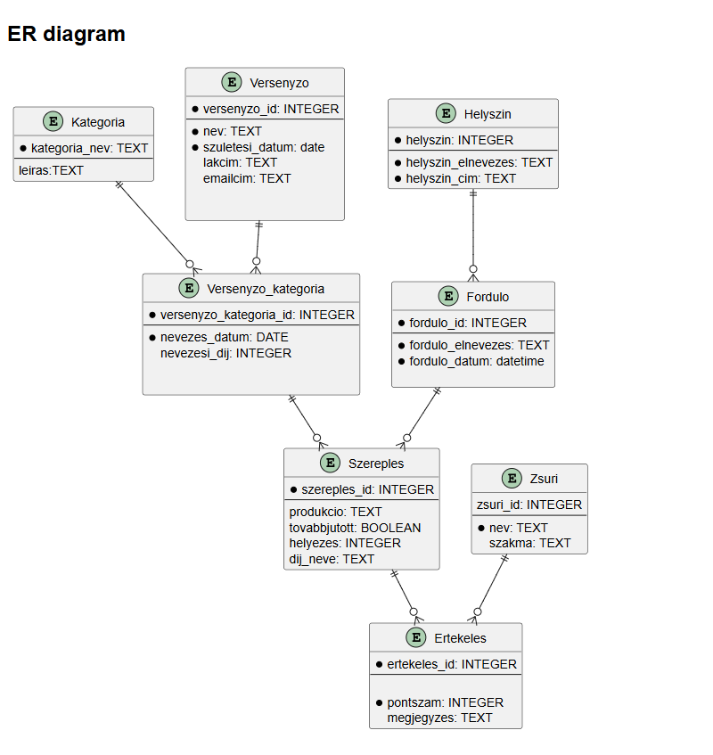
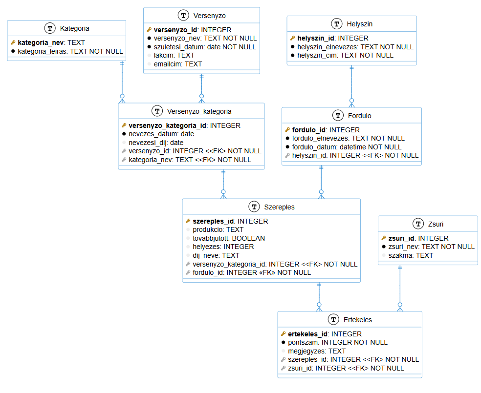

# Tehetségkutató verseny adatmodellje
A projektmunkámban egy többfordulós Ki-mit-tud formátumú tehetségkutató verseny modelljét dolgoztam ki.
A csapat tagjai: Szilágyi Ágnes Lilla

A végleges implementáció SQLite relációs adatbáziskezelő segítségével készült el.

Az ábrákat plantUML md fájlokban készítettem Visual Studio Code editorban plantUML preview bővítmény segítségével, a forrásfájlok a plantUML mappába találhatóak.

## Logika adatmodell
## Entitások:
### Kategoria 
A versenyben többfajta kategóriában lehet indulni, minden kategóriát külön-külön értékelnek
### Versenyzo 
A tehetségkutató versenyzői.
### Helszin
A tehetségkutató lehetséges helyszínei.
### Zsuri
Zsűri tagok, akik a versenyzők produkcióját értékelik, egy zsüritag, akár többfajta kategóriájú produkciót értékelhet.
### Versenyzo_kategoria
Egy versenyző akár többfajta kategóriában is indulhat.
### Forduló
A versenyfordulók, amelyben többfajta kategóriában is versenyezhetnek.

### Szereples
Egy versenyző  egy adott fordulóban és egy adott kategóriában egy műsorszámot adhat elő, ez alapján határozzák meg, hogy továbbjutott-e. Az első három helyezet majd később díjat is kap.
### Ertekeles
Egy versenyző  egy adott fordulóban és egy adott kategóriában egy előadott műsorszámára egy adott zsűritag mennyipont adott.

Az entitások közötti logika kapcsolatot a következő ER diagram szemlélteti

## Fizika adatmodell
A logikai adatmodellből a következő relációs adatbázis fizikai modell készíthető SQLite adatbázisra.

